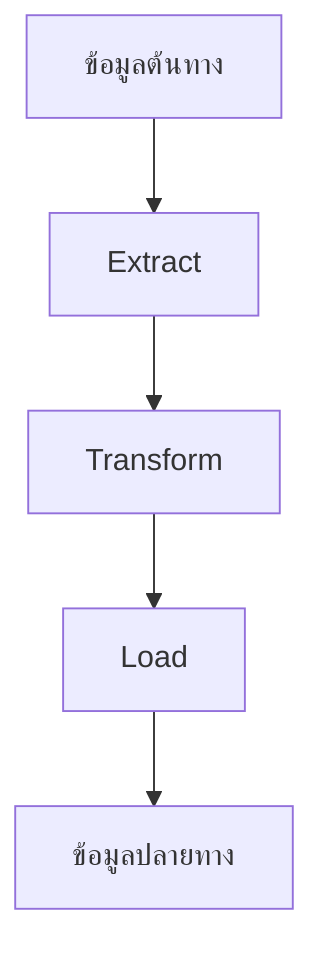

# เทมเพลตเอกสารและการจัดการเอกสารสำหรับ Data Engineer

## Table of Contents
- [เมื่อโค้ดอย่างเดียวไม่พอ](#เมื่อโค้ดอย่างเดียวไม่พอ)
- [Knowledge](#knowledge)
- [Pre-Requirement](#pre-requirement)
- [Concept พื้นฐานของการจัดการเอกสาร](#concept-พื้นฐานของการจัดการเอกสาร)
- [เทมเพลตเอกสารที่จำเป็นสำหรับ Data Engineer](#เทมเพลตเอกสารที่จำเป็นสำหรับ-data-engineer)
- [การสร้างระบบจัดการเอกสาร](#การสร้างระบบจัดการเอกสาร)
- [เทคนิคและเครื่องมือที่ช่วยในการจัดการเอกสาร](#เทคนิคและเครื่องมือที่ช่วยในการจัดการเอกสาร)

## เมื่อโค้ดอย่างเดียวไม่พอ

เคยเจอสถานการณ์แบบนี้มั้ย? เข้ามาทำงานในโปรเจคใหม่ แล้วต้องนั่งงงกับ Pipeline ที่คนอื่นเขียนไว้ ไม่รู้ว่ามันทำงานยังไง ข้อมูลมาจากไหน ไปไหน หรือแย่กว่านั้น คือตัวเองเขียน Pipeline ไว้เมื่อ 6 เดือนก่อน แล้วตอนนี้กลับมาดูแล้วจำไม่ได้เลยว่าเขียนอะไรไว้!

นี่แหละครับ ปัญหาที่เกิดจากการไม่มีเอกสารที่ดี ซึ่งผมเองก็เคยเจอมาแล้ว ตอนเริ่มทำงานใหม่ๆ คิดว่าแค่เขียนโค้ดให้ทำงานได้ก็พอ แต่พอโปรเจคเยอะขึ้น คนในทีมเปลี่ยนไปเปลี่ยนมา ก็เริ่มเห็นความสำคัญของการทำเอกสารมากขึ้น

วันนี้เลยอยากมาแชร์ประสบการณ์และความรู้เกี่ยวกับการจัดการเอกสารสำหรับ Data Engineer ที่จะช่วยให้น้องๆ ทำงานได้อย่างมีประสิทธิภาพมากขึ้นครับ!

## Knowledge

การเรียนรู้เรื่องการจัดการเอกสารจะช่วยพัฒนาทักษะและความรู้ในด้านต่อไปนี้:

- **การสื่อสาร**: พัฒนาทักษะการอธิบายระบบที่ซับซ้อนให้เข้าใจง่าย
- **การจัดระเบียบความคิด**: การเขียนเอกสารช่วยให้เราจัดระเบียบความคิดและเข้าใจระบบได้ดีขึ้น
- **การทำงานร่วมกัน**: เอกสารที่ดีช่วยให้ทีมทำงานร่วมกันได้อย่างมีประสิทธิภาพ
- **การจัดการความรู้**: สร้างฐานความรู้ที่สามารถส่งต่อให้คนอื่นได้
- **เครื่องมือจัดการเอกสาร**: เรียนรู้การใช้เครื่องมือต่างๆ เช่น Markdown, Wiki, Git

## Pre-Requirement

ก่อนจะเริ่มเรียนรู้เรื่องการจัดการเอกสาร ควรมีความรู้พื้นฐานดังนี้:

- **ความรู้พื้นฐานด้าน Data Engineering**: เข้าใจกระบวนการทำงานของ Data Pipeline
- **พื้นฐานการใช้ Git**: เข้าใจการใช้ Git เพื่อจัดการเวอร์ชันของเอกสาร
- **ความรู้เบื้องต้นเกี่ยวกับ Markdown**: รูปแบบการเขียนเอกสารที่นิยมใช้ใน GitHub, GitLab
- **เครื่องมือที่ควรรู้จัก**:
  - เครื่องมือเขียนเอกสาร: VS Code, Notion, Confluence
  - เครื่องมือสร้างแผนภาพ: Draw.io, Lucidchart, Mermaid
  - เครื่องมือจัดการเอกสาร: GitHub Wiki, GitLab Wiki, Confluence

## Concept พื้นฐานของการจัดการเอกสาร

การจัดการเอกสารที่ดีสำหรับ Data Engineer มีหลักการสำคัญดังนี้:

### 1. Documentation as Code
แนวคิดในการจัดการเอกสารเหมือนกับการจัดการโค้ด:
- เก็บเอกสารไว้ใน Version Control System เช่น Git
- มีกระบวนการ Review เอกสารเหมือนกับ Code Review
- อัพเดทเอกสารเมื่อมีการเปลี่ยนแปลงโค้ด

### 2. Single Source of Truth
มีแหล่งข้อมูลเดียวที่เป็นแหล่งอ้างอิงหลัก เพื่อป้องกันความสับสนและข้อมูลที่ขัดแย้งกัน

### 3. Living Documentation
เอกสารควรเป็น "สิ่งมีชีวิต" ที่ได้รับการอัพเดทอยู่เสมอ ไม่ใช่เขียนครั้งเดียวแล้วทิ้งไว้

### 4. Audience-Oriented
เขียนเอกสารโดยคำนึงถึงผู้อ่าน ว่าเป็นใคร ต้องการข้อมูลอะไร และมีพื้นฐานความรู้ระดับไหน

### 5. Automation
ใช้เครื่องมืออัตโนมัติช่วยในการสร้างและอัพเดทเอกสาร เช่น การสร้าง API Documentation จากโค้ด

## เทมเพลตเอกสารที่จำเป็นสำหรับ Data Engineer

### 1. README.md
เอกสารแรกที่ทุกคนควรอ่านเมื่อเข้ามาในโปรเจค ควรประกอบด้วย:

```markdown
# ชื่อโปรเจค

## วัตถุประสงค์
อธิบายว่าโปรเจคนี้ทำอะไร แก้ปัญหาอะไร

## การติดตั้งและการตั้งค่า
ขั้นตอนการติดตั้งและตั้งค่าโปรเจค

## การใช้งาน
วิธีการใช้งานโปรเจค พร้อมตัวอย่าง

## โครงสร้างโปรเจค
อธิบายโครงสร้างไฟล์และไดเรกทอรี

## การพัฒนาเพิ่มเติม
คำแนะนำสำหรับผู้ที่ต้องการพัฒนาต่อ

## ผู้พัฒนา
รายชื่อผู้พัฒนาและข้อมูลติดต่อ
```

### 2. Data Pipeline Documentation
เอกสารอธิบาย Data Pipeline ควรมีรายละเอียดดังนี้:

```markdown
# ชื่อ Pipeline

## ภาพรวม
อธิบายว่า Pipeline นี้ทำอะไร

## แผนภาพการทำงาน
(แทรกแผนภาพที่แสดงการไหลของข้อมูล)

## ข้อมูลนำเข้า (Input)
- แหล่งข้อมูล
- รูปแบบข้อมูล
- ความถี่ในการอัพเดท

## กระบวนการ (Process)
- ขั้นตอนการประมวลผล
- การแปลงข้อมูล (Transformation)
- การตรวจสอบคุณภาพข้อมูล

## ผลลัพธ์ (Output)
- ที่เก็บข้อมูลผลลัพธ์
- รูปแบบข้อมูลผลลัพธ์
- ผู้ใช้งานข้อมูล

## การตั้งค่าและพารามิเตอร์
- ตัวแปรสภาพแวดล้อม
- พารามิเตอร์ที่ปรับแต่งได้

## การจัดการข้อผิดพลาด
- กรณีที่อาจเกิดข้อผิดพลาด
- วิธีการแก้ไข

## การติดตามและตรวจสอบ
- วิธีการติดตามการทำงาน
- ตัวชี้วัดสำคัญ (KPIs)

## ประวัติการเปลี่ยนแปลง
- วันที่
- ผู้เปลี่ยนแปลง
- รายละเอียดการเปลี่ยนแปลง
```

### 3. Data Dictionary
เอกสารอธิบายโครงสร้างและความหมายของข้อมูล:

```markdown
# Data Dictionary: [ชื่อชุดข้อมูล]

## ตาราง: [ชื่อตาราง]

| ชื่อฟิลด์ | ประเภทข้อมูล | คำอธิบาย | ตัวอย่างข้อมูล | หมายเหตุ |
|----------|------------|---------|-------------|---------|
| user_id  | INTEGER    | รหัสผู้ใช้งาน | 12345      | Primary Key |
| name     | VARCHAR(100) | ชื่อผู้ใช้งาน | สมชาย สมใจ | |
| created_at | TIMESTAMP | วันที่สร้างข้อมูล | 2025-01-01 12:00:00 | |
```

### 4. Architecture Document
เอกสารอธิบายสถาปัตยกรรมของระบบ:

```markdown
# สถาปัตยกรรมระบบ [ชื่อระบบ]

## ภาพรวมสถาปัตยกรรม
(แทรกแผนภาพสถาปัตยกรรม)

## องค์ประกอบหลัก
- Data Sources
- Data Storage
- Processing Engines
- Visualization Tools

## การเชื่อมต่อระหว่างองค์ประกอบ
อธิบายวิธีการเชื่อมต่อและการสื่อสารระหว่างองค์ประกอบ

## ความต้องการด้านทรัพยากร
- ความต้องการด้านฮาร์ดแวร์
- ความต้องการด้านซอฟต์แวร์
- การปรับขนาด (Scaling)

## ความปลอดภัย
- การรักษาความปลอดภัยของข้อมูล
- การควบคุมการเข้าถึง
- การเข้ารหัส

## การสำรองข้อมูลและการกู้คืน
- กลยุทธ์การสำรองข้อมูล
- กระบวนการกู้คืน
```

### 5. Runbook
เอกสารสำหรับการดำเนินงานและแก้ไขปัญหา:

```markdown
# Runbook: [ชื่อระบบ]

## การเริ่มต้นระบบ
ขั้นตอนการเริ่มต้นระบบ

## การหยุดระบบ
ขั้นตอนการหยุดระบบอย่างปลอดภัย

## การตรวจสอบสถานะ
วิธีการตรวจสอบว่าระบบทำงานปกติ

## ปัญหาที่พบบ่อยและวิธีแก้ไข
| ปัญหา | สาเหตุที่เป็นไปได้ | วิธีแก้ไข |
|------|-----------------|---------|
| Pipeline ล้มเหลว | ข้อมูลต้นทางไม่พร้อม | ตรวจสอบแหล่งข้อมูลและรันใหม่ |
| ข้อมูลไม่อัพเดท | Scheduler ไม่ทำงาน | รีสตาร์ท Scheduler |

## ขั้นตอนการกู้คืนระบบ
ขั้นตอนการกู้คืนระบบหลังจากเกิดปัญหา

## ข้อมูลติดต่อ
รายชื่อและข้อมูลติดต่อของผู้ที่เกี่ยวข้อง
```

## การสร้างระบบจัดการเอกสาร

การสร้างระบบจัดการเอกสารที่ดีควรมีขั้นตอนดังนี้:

### 1. กำหนดนโยบายและมาตรฐาน
- กำหนดว่าต้องมีเอกสารอะไรบ้าง
- กำหนดรูปแบบและมาตรฐานของเอกสาร
- กำหนดกระบวนการอัพเดทเอกสาร

### 2. เลือกเครื่องมือที่เหมาะสม
เลือกเครื่องมือที่เหมาะกับทีมและองค์กร เช่น:
- GitHub/GitLab Wiki สำหรับทีมที่ใช้ Git
- Confluence สำหรับองค์กรที่ใช้ Atlassian Suite
- Notion สำหรับทีมที่ต้องการความยืดหยุ่น

### 3. สร้างโครงสร้างเอกสาร
จัดโครงสร้างเอกสารให้เป็นระเบียบและค้นหาง่าย:

```
/docs
  /architecture
    system-overview.md
    data-flow.md
  /pipelines
    pipeline-a.md
    pipeline-b.md
  /data-dictionary
    table-a.md
    table-b.md
  /runbooks
    daily-operations.md
    troubleshooting.md
  /tutorials
    getting-started.md
    development-guide.md
```

### 4. รวมการทำเอกสารเข้ากับกระบวนการพัฒนา
- เพิ่มการทำเอกสารเป็นส่วนหนึ่งของ Definition of Done
- ตรวจสอบเอกสารในขั้นตอน Code Review
- อัพเดทเอกสารเมื่อมีการเปลี่ยนแปลงโค้ด

### 5. สร้างวัฒนธรรมการทำเอกสาร
- ให้ความสำคัญกับการทำเอกสารเท่ากับการเขียนโค้ด
- สร้างแรงจูงใจในการทำเอกสารที่ดี
- จัดอบรมเรื่องการเขียนเอกสารที่มีประสิทธิภาพ

## เทคนิคและเครื่องมือที่ช่วยในการจัดการเอกสาร

### เทคนิคที่ควรรู้

1. **Markdown เบื้องต้น**
Markdown เป็นภาษาที่ใช้ในการเขียนเอกสารที่อ่านง่ายและสามารถแปลงเป็น HTML ได้:

```markdown
# หัวข้อใหญ่
## หัวข้อรอง
### หัวข้อย่อย

**ตัวหนา** และ *ตัวเอียง*

- รายการแบบจุด
- รายการแบบจุด

1. รายการแบบตัวเลข
2. รายการแบบตัวเลข

[ลิงก์](https://www.example.com)


| คอลัมน์ 1 | คอลัมน์ 2 |
|----------|----------|
| ข้อมูล 1  | ข้อมูล 2  |
```

2. **Mermaid สำหรับสร้างแผนภาพ**
Mermaid เป็นเครื่องมือสร้างแผนภาพจาก code ที่สามารถใช้ใน GitHub, GitLab:



3. **การใช้ Templates**
สร้างเทมเพลตสำหรับเอกสารประเภทต่างๆ เพื่อให้ทุกคนในทีมสามารถสร้างเอกสารที่มีรูปแบบเดียวกัน

4. **การใช้ Tags และ Categories**
ใช้ tags และ categories เพื่อจัดหมวดหมู่เอกสารและช่วยในการค้นหา

5. **การใช้ Automated Documentation Tools**
ใช้เครื่องมืออัตโนมัติเพื่อสร้างเอกสารจากโค้ด เช่น:
- Sphinx สำหรับ Python
- JavaDoc สำหรับ Java
- Swagger/OpenAPI สำหรับ API

### เครื่องมือที่น่าสนใจ

1. **Docusaurus**
เครื่องมือสร้างเว็บไซต์เอกสารที่มีประสิทธิภาพ พัฒนาโดย Facebook

2. **MkDocs**
เครื่องมือสร้างเว็บไซต์เอกสารจาก Markdown ที่เรียบง่ายและใช้งานง่าย

3. **Docsify**
เครื่องมือสร้างเว็บไซต์เอกสารแบบ SPA (Single Page Application) ที่ไม่ต้อง build

4. **Obsidian**
เครื่องมือจดบันทึกที่เชื่อมโยงความคิดและเอกสารเข้าด้วยกัน เหมาะสำหรับการสร้าง Knowledge Base

5. **Draw.io / diagrams.net**
เครื่องมือสร้างแผนภาพที่ใช้งานง่ายและสามารถบันทึกไฟล์ลงใน Git ได้

## สรุป

การจัดการเอกสารที่ดีเป็นทักษะสำคัญสำหรับ Data Engineer ที่มักถูกมองข้าม แต่มีผลกระทบอย่างมากต่อประสิทธิภาพการทำงานของทีมและความยั่งยืนของโปรเจค การลงทุนเวลาในการสร้างระบบจัดการเอกสารที่ดีตั้งแต่เริ่มต้นจะช่วยประหยัดเวลาและความพยายามในระยะยาว

เริ่มต้นจากการสร้างเทมเพลตพื้นฐาน กำหนดมาตรฐาน และค่อยๆ สร้างวัฒนธรรมการทำเอกสารในทีม ไม่จำเป็นต้องสมบูรณ์แบบตั้งแต่แรก แต่ควรมีการปรับปรุงอย่างต่อเนื่อง

สุดท้ายนี้ อย่าลืมว่าเอกสารที่ดีที่สุดคือเอกสารที่คนอ่านเข้าใจได้ง่ายและมีประโยชน์ต่อการทำงาน ไม่ใช่เอกสารที่มีรายละเอียดมากที่สุดหรือสวยงามที่สุด

หวังว่าบทความนี้จะช่วยให้น้องๆ เห็นความสำคัญของการจัดการเอกสารและสามารถนำไปประยุกต์ใช้ในงานได้ไม่มากก็น้อยนะครับ หากมีคำถามหรือข้อสงสัย สามารถแชร์ในคอมเมนต์ได้เลยครับ!
